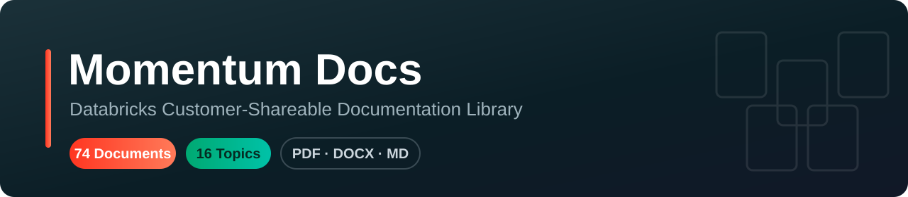

# 📖 Databricks Document Repository
#### Momentum Health · Customer-Shareable Documentation Library

A curated, topic-organized library of Databricks product decks, best-practice guides,
deployment playbooks, and enablement material — ready to share with customers.

  

---

## 📊 At a Glance

The whole library in one view — grouped by theme. Click a topic to jump to its documents.

| Theme | Topic | Docs | Description |
|---|---|:---:|---|
| **🧠 AI & GenAI** | 🚪 [AI Gateway & Omnigent](#-ai-gateway--omnigent) | 3 | Unity AI Gateway product decks and overviews |
|  | ✨ [GenAI](#-genai) | 3 | Generative AI big books and enterprise AI guides |
|  | 🧩 [Omnigent](#-omnigent) | 2 | Omnigent meta-harness for AI agents |
|  | 🤖 [AI Agents](#-ai-agents) | 1 | Agent research and industry reports |
| **🧞 Genie** | 🧞 [Genie (Best Practices)](#-genie-best-practices) | 12 | AI/BI Genie best practices, curation, and pitch material |
|  | 🚀 [Genie (Deploy Guides)](#-genie-deploy-guides) | 11 | Genie rollout, migration, and enterprise deployment |
| **🗂️ Governance & Data** | 🔒 [Genie (Security & Governance)](#-genie-security--governance) | 7 | AI/Genie security, guardrails, and governance frameworks |
|  | 📐 [Semantic-Modelling](#-semantic-modelling) | 5 | UC Metric Views and semantic layer modeling |
|  | 📚 [Unity Catalogue](#-unity-catalogue) | 5 | Unity Catalog design, best practices, and governance |
|  | 🧱 [Data Modelling](#-data-modelling) | 3 | Dimensional and Data Vault modeling for the Lakehouse |
|  | 🛡️ [Data Governance & Lineage](#-data-governance--lineage) | 1 | Data & AI governance and lineage guidance |
| **⚙️ Platform & Ops** | 📦 [DABS](#-dabs) | 6 | Databricks Asset Bundles — CI/CD and declarative deployment |
|  | 💰 [FinOps](#-finops) | 5 | Cost control, budgeting, tagging, and observability |
|  | 🖥️ [Databricks Apps](#-databricks-apps) | 3 | Building and deploying data & AI apps on Databricks |
|  | ☁️ [Azure](#-azure) | 2 | Azure Databricks architecture and capability comparisons |
|  | ⚡ [Lakehouse :: RT](#-lakehouse--rt) | 1 | Lakehouse real-time processing |
| **📣 Announcements** | 📣 [DAIS 2026 Announcements](#-dais-2026-announcements) | 1 | Data + AI Summit 2026 announcements |

> **71 documents** across **17 topics** in **5 themes**.

---

## 🧭 How to Use This Repository

- **Browse by theme** — the table above groups every topic into five themes.
- **Open a document** — click any title; files render or download straight from GitHub.
- **Filenames tagged `[External]` / `[Customer Facing]`** are cleared for direct customer sharing.
- Each section below lists its documents with type and a back-to-top link.

---

# 🧠 AI & GenAI

## 🤖 AI Agents

> Agent research and industry reports

| # | Document | Type |
|---|---|:---:|
| 1 | 📄 [State-of-AI-Agents-2026-Final.pdf](AI%20Agents/State-of-AI-Agents-2026-Final.pdf) | `PDF` |

[⬆ Back to top](#-databricks-document-repository)

## 🚪 AI Gateway & Omnigent

> Unity AI Gateway product decks and overviews

| # | Document | Type |
|---|---|:---:|
| 1 | 📄 [Databricks Unity AI Gateway Product Deck.pdf](AI%20Gateway%20%26%20Omnigent/Databricks%20Unity%20AI%20Gateway%20Product%20Deck.pdf) | `PDF` |
| 2 | 📄 [Unity AI Gateway & Omnigent Overview.pdf](AI%20Gateway%20%26%20Omnigent/Unity%20AI%20Gateway%20%26%20Omnigent%20Overview.pdf) | `PDF` |
| 3 | 📄 [Unity AI Gateway Product Overview Deck.pdf](AI%20Gateway%20%26%20Omnigent/Unity%20AI%20Gateway%20Product%20Overview%20Deck.pdf) | `PDF` |

[⬆ Back to top](#-databricks-document-repository)

## ✨ GenAI

> Generative AI big books and enterprise AI guides

| # | Document | Type |
|---|---|:---:|
| 1 | 📄 [Databricks-Big-Book-Of-GenAI-FINAL.pdf](GenAI/Databricks-Big-Book-Of-GenAI-FINAL.pdf) | `PDF` |
| 2 | 📄 [databricks-ebook-a-compact-guide-to-agent-systems.pdf](GenAI/databricks-ebook-a-compact-guide-to-agent-systems.pdf) | `PDF` |
| 3 | 📄 [unlocking-enterprise-ai.pdf](GenAI/unlocking-enterprise-ai.pdf) | `PDF` |

[⬆ Back to top](#-databricks-document-repository)

## 🧩 Omnigent

> Omnigent meta-harness for AI agents

| # | Document | Type |
|---|---|:---:|
| 1 | 📄 [Omnigent - A Meta-Harness for AI Agents.pdf](Omnigent/Omnigent%20-%20A%20Meta-Harness%20for%20AI%20Agents.pdf) | `PDF` |
| 2 | 📄 [Omnigent Announcement (DAIS 2026 Enablement 101).pdf](Omnigent/Omnigent%20Announcement%20%28DAIS%202026%20Enablement%20101%29.pdf) | `PDF` |

[⬆ Back to top](#-databricks-document-repository)

---

# 🧞 Genie

## 🧞 Genie (Best Practices)

> AI/BI Genie best practices, curation, and pitch material

| # | Document | Type |
|---|---|:---:|
| 1 | 📄 [[Genie] Best Practices for Curating and Managing Genie Spaces.pdf](Genie%20%28Best%20Practices%29/%5BGenie%5D%20Best%20Practices%20for%20Curating%20and%20Managing%20Genie%20Spaces.pdf) | `PDF` |
| 2 | 📄 [[Genie] Cost Optimization Best Practices.pdf](Genie%20%28Best%20Practices%29/%5BGenie%5D%20Cost%20Optimization%20Best%20Practices.pdf) | `PDF` |
| 3 | 📄 [AI-BI Genie Launch.pdf](Genie%20%28Best%20Practices%29/AI-BI%20Genie%20Launch.pdf) | `PDF` |
| 4 | 📄 [AI_BI - L200 Technical Pitch Deck.pdf](Genie%20%28Best%20Practices%29/AI_BI%20-%20L200%20Technical%20Pitch%20Deck.pdf) | `PDF` |
| 5 | 📄 [AI_BI Genie Best Practices.pdf](Genie%20%28Best%20Practices%29/AI_BI%20Genie%20Best%20Practices.pdf) | `PDF` |
| 6 | 🖼️ [AIBI + Genie Launchpad.jpg](Genie%20%28Best%20Practices%29/AIBI%20%2B%20Genie%20Launchpad.jpg) | `JPG` |
| 7 | 📄 [Best Practices for Curating and Managing Genie Spaces.pdf](Genie%20%28Best%20Practices%29/Best%20Practices%20for%20Curating%20and%20Managing%20Genie%20Spaces.pdf) | `PDF` |
| 8 | 📄 [Building Effective AI_BI Genie Spaces.pdf](Genie%20%28Best%20Practices%29/Building%20Effective%20AI_BI%20Genie%20Spaces.pdf) | `PDF` |
| 9 | 📄 [Databricks Genie - Intelligent Analysis.pdf](Genie%20%28Best%20Practices%29/Databricks%20Genie%20-%20Intelligent%20Analysis.pdf) | `PDF` |
| 10 | 📄 [Databricks_AI_BI Genie - Best Practices.pdf](Genie%20%28Best%20Practices%29/Databricks_AI_BI%20Genie%20-%20Best%20Practices.pdf) | `PDF` |
| 11 | 📄 [Genie Best Practices.pdf](Genie%20%28Best%20Practices%29/Genie%20Best%20Practices.pdf) | `PDF` |
| 12 | 📄 [Genie Conversational API Best Practices.pdf](Genie%20%28Best%20Practices%29/Genie%20Conversational%20API%20Best%20Practices.pdf) | `PDF` |

[⬆ Back to top](#-databricks-document-repository)

## 🚀 Genie (Deploy Guides)

> Genie rollout, migration, and enterprise deployment

| # | Document | Type |
|---|---|:---:|
| 1 | 📄 [[Customer Facing] Databricks Share Genie Beyond the Workspace Private Preview User Guide.pdf](Genie%20%28Deploy%20Guides%29/%5BCustomer%20Facing%5D%20Databricks%20Share%20Genie%20Beyond%20the%20Workspace%20Private%20Preview%20User%20Guide.pdf) | `PDF` |
| 2 | 📄 [[External] Genie Enterprise Deployment Guide .pdf](Genie%20%28Deploy%20Guides%29/%5BExternal%5D%20Genie%20Enterprise%20Deployment%20Guide%20.pdf) | `PDF` |
| 3 | 📝 [[EXTERNAL] Genie Space Rollout Plan Template.docx](Genie%20%28Deploy%20Guides%29/%5BEXTERNAL%5D%20Genie%20Space%20Rollout%20Plan%20Template.docx) | `DOCX` |
| 4 | 📄 [[EXTERNAL] Genie Space Rollout Plan Template.pdf](Genie%20%28Deploy%20Guides%29/%5BEXTERNAL%5D%20Genie%20Space%20Rollout%20Plan%20Template.pdf) | `PDF` |
| 5 | 📝 [[Template] Genie Space Onboarding Plan.docx](Genie%20%28Deploy%20Guides%29/%5BTemplate%5D%20Genie%20Space%20Onboarding%20Plan.docx) | `DOCX` |
| 6 | 📝 [_[CUSTOMER-READY] Genie Space Onboarding Plan Template - go_emea-aibi-sme_genie-onboarding.docx](Genie%20%28Deploy%20Guides%29/_%5BCUSTOMER-READY%5D%20Genie%20Space%20Onboarding%20Plan%20Template%20-%20go_emea-aibi-sme_genie-onboarding.docx) | `DOCX` |
| 7 | 📄 [_[CUSTOMER-READY] Genie Space Onboarding Plan Template - go_emea-aibi-sme_genie-onboarding.pdf](Genie%20%28Deploy%20Guides%29/_%5BCUSTOMER-READY%5D%20Genie%20Space%20Onboarding%20Plan%20Template%20-%20go_emea-aibi-sme_genie-onboarding.pdf) | `PDF` |
| 8 | 📄 [Genie Agents _ From Implementation to Enterprise Transformation.pdf](Genie%20%28Deploy%20Guides%29/Genie%20Agents%20_%20From%20Implementation%20to%20Enterprise%20Transformation.pdf) | `PDF` |
| 9 | 📄 [Genie Space Migration with DABs.pdf](Genie%20%28Deploy%20Guides%29/Genie%20Space%20Migration%20with%20DABs.pdf) | `PDF` |
| 10 | 📄 [genie-chat-vs-agent.pdf](Genie%20%28Deploy%20Guides%29/genie-chat-vs-agent.pdf) | `PDF` |
| 11 | 📄 [Genie_Space-Design-Guide.pdf](Genie%20%28Deploy%20Guides%29/Genie_Space-Design-Guide.pdf) | `PDF` |

[⬆ Back to top](#-databricks-document-repository)

---

# 🗂️ Governance & Data

## 🛡️ Data Governance & Lineage

> Data & AI governance and lineage guidance

| # | Document | Type |
|---|---|:---:|
| 1 | 📄 [Data & AI Governance.pdf](Data%20Governance%20%26%20Lineage/Data%20%26%20AI%20Governance.pdf) | `PDF` |

[⬆ Back to top](#-databricks-document-repository)

## 🧱 Data Modelling

> Dimensional and Data Vault modeling for the Lakehouse

| # | Document | Type |
|---|---|:---:|
| 1 | 📄 [Data Modeling in DataWareHousing Primer.pdf](Data%20Modelling/Data%20Modeling%20in%20DataWareHousing%20Primer.pdf) | `PDF` |
| 2 | 📄 [Dimensional & Data Vault Modeling for Databricks Lakehouse.pdf](Data%20Modelling/Dimensional%20%26%20Data%20Vault%20Modeling%20for%20Databricks%20Lakehouse.pdf) | `PDF` |
| 3 | 📄 [Dimensional Modeling + Performance tips for Databricks .pdf](Data%20Modelling/Dimensional%20Modeling%20%2B%20Performance%20tips%20for%20Databricks%20.pdf) | `PDF` |

[⬆ Back to top](#-databricks-document-repository)

## 🔒 Genie (Security & Governance)

> AI/Genie security, guardrails, and governance frameworks

| # | Document | Type |
|---|---|:---:|
| 1 | 📄 [  WHITEPAPER-  Databricks Agentic Al Security -  Extension to the Databricks Al Security  Framework.pdf](Genie%20%28Security%20%26%20Governance%29/%20%20WHITEPAPER-%20%20Databricks%20Agentic%20Al%20Security%20-%20%20Extension%20to%20the%20Databricks%20Al%20Security%20%20Framework.pdf) | `PDF` |
| 2 | 📊 [[External] Databricks AI Security Framework v 3.0 - Compendium.xlsm](Genie%20%28Security%20%26%20Governance%29/%5BExternal%5D%20Databricks%20AI%20Security%20Framework%20v%203.0%20-%20Compendium.xlsm) | `XLSM` |
| 3 | 📄 [Databricks AI Features - Security FAQ.pdf](Genie%20%28Security%20%26%20Governance%29/Databricks%20AI%20Features%20-%20Security%20FAQ.pdf) | `PDF` |
| 4 | 📄 [Databricks AI Features Security & Architecture.pdf](Genie%20%28Security%20%26%20Governance%29/Databricks%20AI%20Features%20Security%20%26%20Architecture.pdf) | `PDF` |
| 5 | 📄 [Databricks Foundation Model APIs.pdf](Genie%20%28Security%20%26%20Governance%29/Databricks%20Foundation%20Model%20APIs.pdf) | `PDF` |
| 6 | 📄 [Databricks Genie -  Model Guardrails Assessment.pdf](Genie%20%28Security%20%26%20Governance%29/Databricks%20Genie%20-%20%20Model%20Guardrails%20Assessment.pdf) | `PDF` |
| 7 | 📄 [LLM Hosting Security Architecture.pdf](Genie%20%28Security%20%26%20Governance%29/LLM%20Hosting%20Security%20Architecture.pdf) | `PDF` |

[⬆ Back to top](#-databricks-document-repository)

## 📐 Semantic-Modelling

> UC Metric Views and semantic layer modeling

| # | Document | Type |
|---|---|:---:|
| 1 | 📄 [Building Semantic Models in Databricks with UC Metric Views.pdf](Semantic-Modelling/Building%20Semantic%20Models%20in%20Databricks%20with%20UC%20Metric%20Views.pdf) | `PDF` |
| 2 | 📄 [new app -- dbxmetagen — Explained.pdf](Semantic-Modelling/new%20app%20--%20dbxmetagen%20%E2%80%94%20Explained.pdf) | `PDF` |
| 3 | 📄 [Semantic Layer Partners & Databricks .pdf](Semantic-Modelling/Semantic%20Layer%20Partners%20%26%20Databricks%20.pdf) | `PDF` |
| 4 | 📄 [UC Metric Views .pdf](Semantic-Modelling/UC%20Metric%20Views%20.pdf) | `PDF` |
| 5 | 📄 [UC Metrics & AI For Data Management.pdf](Semantic-Modelling/UC%20Metrics%20%26%20AI%20For%20Data%20Management.pdf) | `PDF` |

[⬆ Back to top](#-databricks-document-repository)

## 📚 Unity Catalogue

> Unity Catalog design, best practices, and governance

| # | Document | Type |
|---|---|:---:|
| 1 | 📄 [2026-06 RPM __ Databricks_ Unity Catalog Design Considerations for Scale.pdf](Unity%20Catalogue/2026-06%20RPM%20__%20Databricks_%20Unity%20Catalog%20Design%20Considerations%20for%20Scale.pdf) | `PDF` |
| 2 | 📄 [A Technical Deep Dive into Unity Catalog's Practitioner Playbook.pdf](Unity%20Catalogue/A%20Technical%20Deep%20Dive%20into%20Unity%20Catalog%27s%20Practitioner%20Playbook.pdf) | `PDF` |
| 3 | 📄 [Unity Catalog - Best Practices and Rapid Start.pdf](Unity%20Catalogue/Unity%20Catalog%20-%20Best%20Practices%20and%20Rapid%20Start.pdf) | `PDF` |
| 4 | 📄 [Unity Catalog - Overview.pdf](Unity%20Catalogue/Unity%20Catalog%20-%20Overview.pdf) | `PDF` |
| 5 | 📄 [Unity Catalog - Unified and Open Governance.pdf](Unity%20Catalogue/Unity%20Catalog%20-%20Unified%20and%20Open%20Governance.pdf) | `PDF` |

[⬆ Back to top](#-databricks-document-repository)

---

# ⚙️ Platform & Ops

## ☁️ Azure

> Azure Databricks architecture and capability comparisons

| # | Document | Type |
|---|---|:---:|
| 1 | 📄 [Azure Databricks Access Connector — When and Why It's Needed.pdf](Azure/Azure%20Databricks%20Access%20Connector%20%E2%80%94%20When%20and%20Why%20It%27s%20Needed.pdf) | `PDF` |
| 2 | 📄 [Databricks vs AWS Native Capability Map.pdf](Azure/Databricks%20vs%20AWS%20Native%20Capability%20Map.pdf) | `PDF` |

[⬆ Back to top](#-databricks-document-repository)

## 📦 DABS

> Databricks Asset Bundles — CI/CD and declarative deployment

| # | Document | Type |
|---|---|:---:|
| 1 | 📄 [[External] The Full Stack of Innovation_ Building Data & AI Products with Databricks Apps _ DAIS 2025.pdf](DABS/%5BExternal%5D%20The%20Full%20Stack%20of%20Innovation_%20Building%20Data%20%26%20AI%20Products%20with%20Databricks%20Apps%20_%20DAIS%202025.pdf) | `PDF` |
| 2 | 📄 [Automate Deployment with Declarative Automation Bundles (DAIS, 2026).pdf](DABS/Automate%20Deployment%20with%20Declarative%20Automation%20Bundles%20%28DAIS%2C%202026%29.pdf) | `PDF` |
| 3 | 📄 [Automated Deployment with Declarative Automation Bundles (Databricks Academy).pdf](DABS/Automated%20Deployment%20with%20Declarative%20Automation%20Bundles%20%28Databricks%20Academy%29.pdf) | `PDF` |
| 4 | 📄 [CI CD Best Practices on Databricks .pdf](DABS/CI%20CD%20Best%20Practices%20on%20Databricks%20.pdf) | `PDF` |
| 5 | 📄 [Databricks Asset Bundles Workshop.pdf](DABS/Databricks%20Asset%20Bundles%20Workshop.pdf) | `PDF` |
| 6 | 📄 [Get Started with Declarative Asset Bundles.pdf](DABS/Get%20Started%20with%20Declarative%20Asset%20Bundles.pdf) | `PDF` |

[⬆ Back to top](#-databricks-document-repository)

## 🖥️ Databricks Apps

> Building and deploying data & AI apps on Databricks

| # | Document | Type |
|---|---|:---:|
| 1 | 📄 [Databricks Apps - Hands-On-Guide.pdf](Databricks%20Apps/Databricks%20Apps%20-%20Hands-On-Guide.pdf) | `PDF` |
| 2 | 📄 [Databricks Apps Overview.pdf](Databricks%20Apps/Databricks%20Apps%20Overview.pdf) | `PDF` |
| 3 | 📄 [The Full Stack of Innovation - Building Data & AI Products with Databricks Apps.pdf](Databricks%20Apps/The%20Full%20Stack%20of%20Innovation%20-%20Building%20Data%20%26%20AI%20Products%20with%20Databricks%20Apps.pdf) | `PDF` |

[⬆ Back to top](#-databricks-document-repository)

## 💰 FinOps

> Cost control, budgeting, tagging, and observability

| # | Document | Type |
|---|---|:---:|
| 1 | 📄 [[EXTERNAL] Cost Mgmt & Tagging Best Practices.pdf](FinOps/%5BEXTERNAL%5D%20Cost%20Mgmt%20%26%20Tagging%20Best%20Practices.pdf) | `PDF` |
| 2 | 📄 [Cost Control & Budget Management Workshop.pdf](FinOps/Cost%20Control%20%26%20Budget%20Management%20Workshop.pdf) | `PDF` |
| 3 | 📄 [Databricks Architecture & FinOps Cost Mgmt.pdf](FinOps/Databricks%20Architecture%20%26%20FinOps%20Cost%20Mgmt.pdf) | `PDF` |
| 4 | 📄 [FinOps, Observability and Cost Management.pdf](FinOps/FinOps%2C%20Observability%20and%20Cost%20Management.pdf) | `PDF` |
| 5 | 📄 [Serverless  - Advanced Cost Control & Budget Management.pdf](FinOps/Serverless%20%20-%20Advanced%20Cost%20Control%20%26%20Budget%20Management.pdf) | `PDF` |

[⬆ Back to top](#-databricks-document-repository)

## ⚡ Lakehouse :: RT

> Lakehouse real-time processing

| # | Document | Type |
|---|---|:---:|
| 1 | 📄 [Introducing Lakehouse :: RT.pdf](Lakehouse%20%3A%3A%20RT/Introducing%20Lakehouse%20%3A%3A%20RT.pdf) | `PDF` |

[⬆ Back to top](#-databricks-document-repository)

---

# 📣 Announcements

## 📣 DAIS 2026 Announcements

> Data + AI Summit 2026 announcements

| # | Document | Type |
|---|---|:---:|
| 1 | 📄 [ DAIS 2026 Announcement - Deep Dive Deck.pdf](DAIS%202026%20Announcements/%20DAIS%202026%20Announcement%20-%20Deep%20Dive%20Deck.pdf) | `PDF` |

[⬆ Back to top](#-databricks-document-repository)

---

*Momentum Health · Databricks Document Repository — maintained as a shareable reference library.*  
*Documents are grouped by theme and topic; click any title to open the file.*

